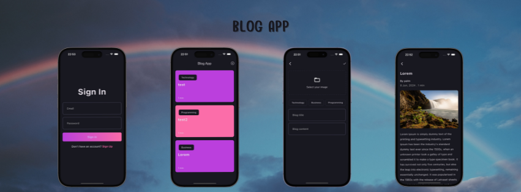

# Blog App

Clean Architecture in Flutter using Supabase, Bloc, Hive, Get_It & FpDart.

## Features
1. Authentication with Email & Password
2. Blog Viewer Page
3. Uploading Content&Image
4. Displaying Content&Images
5. Local Storage and Remote Storage

## Tech Used
**Server**: Supabase

**Client**: Flutter, Bloc, Hive, GetIt
